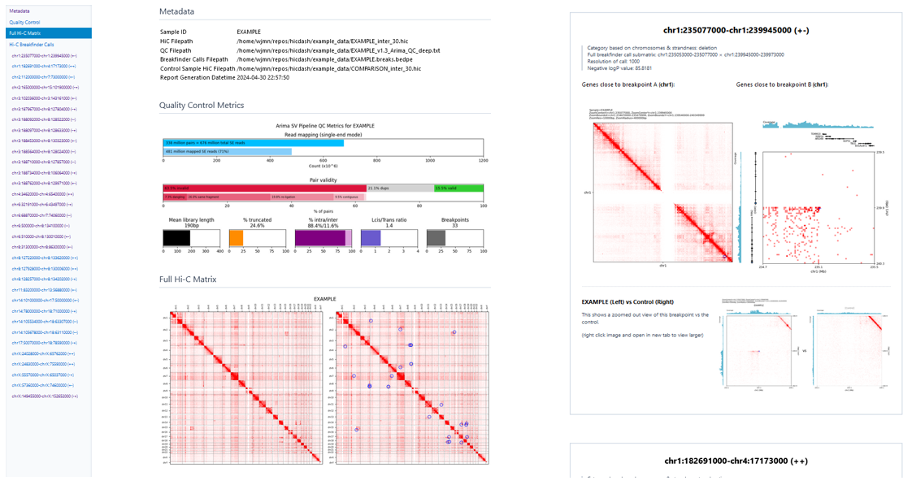

# hicdash: Generate a Hi-C Structural Variant Dashboard



This project provides a command to generate a self-contained HTML file containing plots of all identified structural variants from a Hi-C contact matrix for easy and fast review. 

This tool only generates plots and a report; it does not perform any Hi-C analysis itself. 

This is currently a work in-progress. This project is designed to work with the outputs from the [Arima SV Pipeline (v1.3)](https://github.com/ArimaGenomics/Arima-SV-Pipeline).

## Installation

### Docker 

Thank you to Jon Belton at Arima Genomics for providing a Docker image for easy installation and use, available at: [https://hub.docker.com/r/arimajon/hicdash_ubuntu24](https://hub.docker.com/r/arimajon/hicdash_ubuntu24). This image handles installing all the required dependencies for usage. 

### Manual

To manually install, `git clone` this repo, install the requirements and then install the `hicdash` module. Using a separate Python virtual environment or a new conda environment is strongly suggested (and ensure you have Python >= 3.10). 

```bash
# Clone repo and change directory
git clone https://github.com/wjmn/hicdash
cd hicdash

# Install requirements
pip install -r requirements.txt

# Install hicdash from current directory
pip install .
```

Once installed, you can check if it installed correctly by showing the help info:

```bash
python -m hicdash --help
```

You may also need to run `pyensembl install --release 110 --species homo_sapiens` prior to running hicdash in order to install the Ensembl gene annotations used to plot gene tracks. 

## Usage

Here's an example of running `hicdash` with all the command line options (though you probably don't need all of them at once):

```bash

python -m hicdash \
    --prefix K562 \
    --hic tests/example_data/K562_inter_30.hic \
    --output tests/example_data/K562_report.html \
    --qc tests/example_data/K562_v1.3_Arima_QC_deep.txt \
    --breaks tests/example_data/K562_curated_breakpoints.bedpe \
    --control tests/example_data/GM12878_inter_30.hic \
    --keygenes tests/example_data/keygenes.txt  \
    --targets1 tests/example_data/targets1.txt \
    --targets2 tests/example_data/targets2.txt \
    --flagged tests/example_data/flagged.txt

```

(example data is not included with this repo, so make sure to replace the arguments above with paths to your data)

This will save the Hi-C report into a file called `report.html`. It might take a while to run, depending on how many breakpoints there are. 

Here are the command line arguments:

| Argument | Required? | Description | 
|----------|-----------|-------------|
| `--prefix` | Required | The sample ID or prefix used when running the Arima-SV pipeline. |
| `--hic` | Required | The path to the .hic file output from the Arima-SV pipeline. | 
| `--output` | Required | The path to the file you wish to output the report to (include the .html extension) |
| `--breaks` | Optional | The path to the .breaks.bedpe file output from the Arima-SV pipeline containing hic_breakfinder calls. | 
| `--qc` | Optional | The path to the deep quality control .txt file output from the Arima-SV pipeline. |
| `--control` | Optional | The path to a control .hic file, which will be used for visual plot comparisons. |

While the `--qc`, `--breaks` and `--control` arguments are optional, they are highly recommended. The report won't be very useful without these outputs. 

The breaks provided in `--breaks` are sorted in chromosome order. 

If extra `--bedpe` file(s) are specified, they are simply added as annotations to breakpoints provided by the `--breaks` argument: no merging is done in this package. Use `--breaks` to provide the full set of breakpoints that you wish to plot. 

## Development

### Testing

To run the unittests:

```bash
cd src
python -m unittest
```

## Changelog

* v0.0.2 (2024-05-12)
    * Allow plotting extra 2D (.bedpe) annotations.
    * Allow plotting extra 1D (.bigwig) tracks.
    * Plot zoom plot at call resolution. 
    * More thorough QC metrics.
    * Added row of plots with breakpoint at multiple resolutions to report. 
    * Added crosshair and gridline options. 
    * Miscellaneous bugfixes and visual improvements. 

## Acknowledgements

The [Arima SV Pipeline](https://github.com/ArimaGenomics/Arima-SV-Pipeline) is developed by Arima Genomics. Support for the Arima SV Pipeline can be found on their GitHub page; thank you Arima for outstanding support with using the Arima SV Pipeline. 

This is currently an internal research tool developed at Snuderl Lab, NYU. 
